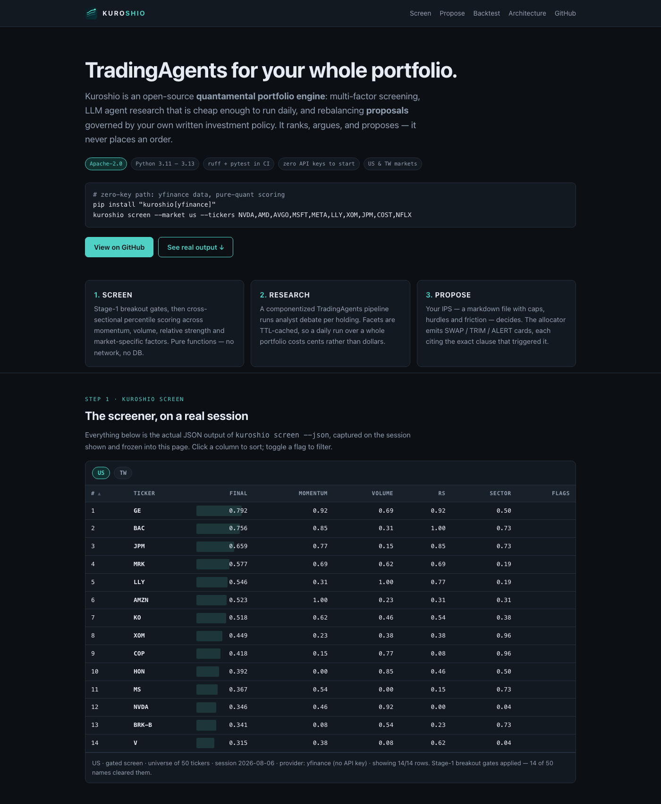
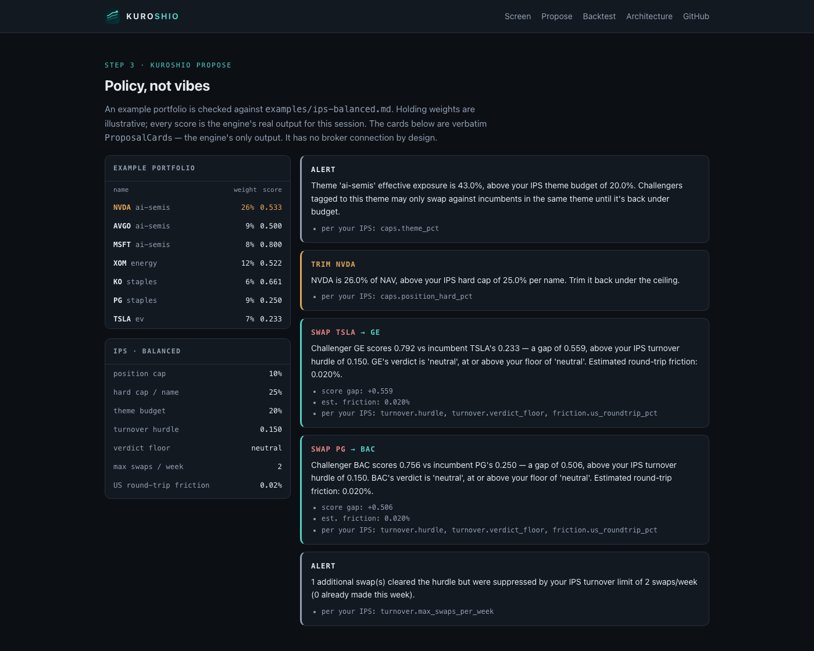
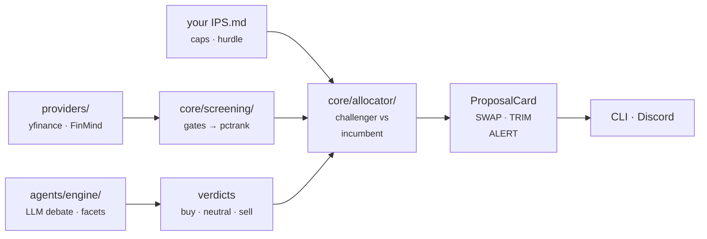

<p align="center">
  
</p>

<h1 align="center">Kuroshio</h1>

<p align="center">
  <em>TradingAgents for your whole portfolio — run it on your holdings daily, not one ticker once.</em>
</p>

<p align="center">
  <a href="https://github.com/HaoweiChan/kuroshio/actions/workflows/ci.yml"></a>
  <a href="LICENSE"></a>
  <a href="pyproject.toml"></a>
  <a href="https://docs.astral.sh/ruff/"></a>
</p>

<p align="center">
  <a href="https://haoweichan.github.io/kuroshio/"><b>▶ Live demo</b></a> — real screener, proposal
  and backtest output from one session, frozen into a single static page.
</p>

<a href="https://haoweichan.github.io/kuroshio/">
  
</a>

Named after the Kuroshio — the Pacific current that carries apex predators past Taiwan.

Kuroshio is an open-source **quantamental portfolio engine**:

- **Screen** — multi-factor momentum screeners (US, TW) with cross-sectional percentile scoring
- **Research** — LLM agent research per holding, facet-cached so daily runs cost cents, not dollars
- **Propose** — IPS-driven challenger-vs-incumbent rebalancing **proposals** (the engine never executes trades)

**Status: 0.x.** Usable today; the API can still change between minor versions.

## Quickstart

```bash
pip install -e ".[yfinance,dev]"

# rank breakout candidates (zero API keys — yfinance default)
kuroshio screen --market us --tickers NVDA,AMD,AVGO,MSFT,META,LLY,XOM,JPM,COST,NFLX

# check a policy file
kuroshio ips-validate examples/ips-balanced.md

# proposal cards: your holdings vs challengers, governed by your IPS
printf -- '- {ticker: AAPL, weight: 0.08, theme: tech, score: 0.55}\n- {ticker: XOM, weight: 0.22, theme: energy, score: 0.30}\n' > holdings.yml
kuroshio propose --ips examples/ips-balanced.md --holdings holdings.yml --market us
```

`score:` is optional (same for `final_score:` in a candidates file) — leave it out and `propose`
fetches prices from the market's provider and fills it in. Hand-typed values always win, per name.
An auto-filled score is **a percentile rank within the names in your own files**, not the number
`kuroshio screen` prints for that name: the pool is your holdings + candidates, not a universe,
and `propose` passes no `--sector-map`/`--asof`. Two things follow. A pool small enough that
your turnover hurdle may not be doing any work gets nothing filled at all — you get the "no
holding has a screener score" ALERT instead of a made-up gap. (That floor is a deliberately
conservative rule of thumb, not an exact cutoff: it will sometimes refuse a pool your hurdle
could have judged fine. Hand-type the scores, or list more names.) Above that size the score is
filled, but percentile ranks pin their extremes to 0.000 and 1.000 however tightly the names
cluster, so every card built from one says which scores were filled and how many names they were
ranked against — and, when the other side of the swap is hand-typed, that the gap spans two
different scales.

Record *why* you own a position — `setup_type:` (value_dip | pullback_add | trend_add |
other) plus `entry_price:` and, for the dip setups, `invalidation_price:` — and `propose`
watches each one on its own terms: a `trend_add` is alerted when it closes under its 50-day
mean, a `value_dip` never is (looking weak against its MAs is the setup) and is alerted only
when it closes at or below the invalidation price you recorded. Positions missing the fields
their rule reads are named on a card instead of quietly going unwatched.

`screen` prints a ranked table; `propose` prints cards like this — every one of them cites the
IPS clause that triggered it:

```
### SWAP TSLA → GE

Challenger GE scores 0.792 vs incumbent TSLA's 0.233 — a gap of 0.559, above your IPS turnover
hurdle of 0.150 plus estimated round-trip friction of 0.020%. GE's verdict is 'neutral', at or
above your floor of 'neutral'.
- score gap: +0.559
- est. friction: 0.020%
- per your IPS: turnover.hurdle, turnover.verdict_floor, friction.us_roundtrip_pct
```

That is one card out of the five the same run produced. The whole set, rendered on the demo
page — a theme-budget breach, a hard-cap trim, two swaps, and the swap the weekly turnover
limit suppressed:

<a href="https://haoweichan.github.io/kuroshio/#propose">
  
</a>

Full walkthrough (including the LLM research pipeline): [examples/quickstart.md](examples/quickstart.md).

## Architecture



Core logic never imports a data vendor: providers are plugins, screening and allocation are pure
functions over plain dataclasses, and every edge is an adapter at the boundary. Details in
[docs/ARCHITECTURE.md](docs/ARCHITECTURE.md); adding a market is one module plus one registry
entry, see [docs/adding-a-market.md](docs/adding-a-market.md). Shipped and planned work:
[docs/ROADMAP.md](docs/ROADMAP.md).

## Maintenance & support

Self-hosted engine, provided as-is — no SLA. Issues and PRs are triaged
against the maintainer's roadmap on maintainer time, not on demand; see
[CONTRIBUTING.md](CONTRIBUTING.md). Security reports are the exception and
always take priority; see [SECURITY.md](SECURITY.md).

## License

Apache 2.0. Includes components derived from
[TradingAgents](https://github.com/TauricResearch/TradingAgents) (Apache 2.0) — see NOTICE.

## Disclaimer

Kuroshio is a software tool. It produces research reports and rule-triggered proposals from
**your own** rules (IPS) and **your own** API keys. It is not investment advice, and it never
places orders. Any figures in this repo or on the demo page are illustrative output from a fixed
ticker list on one session — not live data, not a recommendation, and not a track record.
